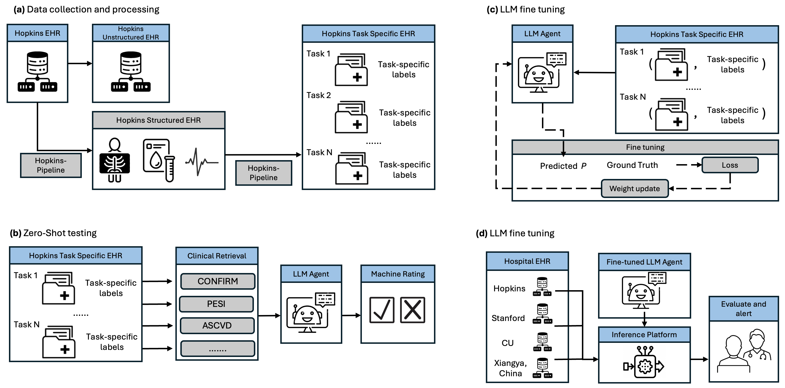

# Integrating Large Language Models for Enhanced Predictive Analytics in Healthcare

- **Authors**: Yuli Wang*, Yuwei Dai*, Robin Wang, Tej Mehta, Premal Trivedi, Thao Vu, Cheng Ting Lin, Li Yang, Zhicheng Jiao, Ihab Kamel, Jing Wu, and Harrison Bai (*equal contributions)
- **Paper** : [Read our paper]()


## Abstract

Physicians frequently confront time-sensitive decisions under uncertain conditions, necessitating reliable tools for forecasting clinical outcomes. Although clinical predictive models have the potential to assist in these critical decisions, their widespread adoption is hindered by complexities in data handling, model development, and integration into clinical workflows. This study introduces a pioneering framework leveraging structured electronic health record (EHR) data to develop and deploy clinical large language models (LLMs) that act as versatile predictive engines with minimal barriers to implementation. Employing the advanced LLaMA architecture, consisting of 7 billion parameters, our model was pre-trained on a comprehensive corpus and subsequently fine-tuned and tested on a dataset of 42,160 patients within Johns Hopkins Health System, addressing a spectrum of clinical and operational prediction tasks. We validated our model across three diverse external health systems and four key prediction tasks involving 1,329 patients, including 30-day all-cause readmissions, 90-day all-cause mortality, 30-day intensive care unit (ICU) admissions, and treatment recommendations. The proposed LLM framework achieved a mean area under the receiver operating characteristic curve (ROC-AUC) of 0.84, yielding a significant 0.28 advancement over zero-shot baseline LLMs. These findings underscore the promise of LLMs as unified, user-friendly clinical prediction systems, adept at reasoning across diverse data sources to enhance decision-making at the point of care.



Our Hopkins-LLM are developed through the Internal dataset from Johns Hopkins Hospital. But, our pipeline also supports the following datasets:

- [x] [MIMIC-IV](https://physionet.org/content/mimiciv/3.0/)

We provide three common tasks for clinical prediction:

| Task      | Type        |Details |
| :-------: | ----------- | :---------: |
| Mortality Prediction		 |    Binary Classification     |    Predict whether this visit patient will die, answer 1 if yes, otherwise 0 |
| Readmission Prediction		 |    Binary Classification     |    Predict whether the patient will be readmitted to the hospital within 30 days after this visit, answer 1 if yes, otherwise 0 |
| ICU admission Prediction		 |    Binary Classification     |    Predict whether the patient will be readmitted to ICU within 30 days after this visit, answer 1 if yes, otherwise 0 |
| Treatment Prediction		 |    Binary Classification     |    Predict whether the patient will undergo treated cholecystectomy after this visit, answer 1 if yes, otherwise 0 |

## Environment Setup

Clone the repository

```shell
git clone https://github.com/canyuchen/ClinicalBench.git
cd ClinicalBench
```


Download the environment

```shell
conda create -n clibench python=3.8
conda activate clibench
pip install .
cd src
```

The structure of the important files:

```shell
llm4clinical_prediction_release/
└── src/
    ├── process_data.sh
    ├── test.py
    ├── test_withprob.py
    ├── tradition.py
    ├── calculate.py
    ├── data/
    │   ├── length_pred/
    │   │   ├── mimic3/
    │   │   └── mimic4/
    │   ├── mortality_pred/
    │   │   ├── mimic3/
    │   │   └── mimic4/
    │   └── readmission_pred/
    │       ├── mimic3/
    │       └── mimic4/
    └── results/
        ├── length_pred/
        │   ├── mimic3/
        │   └── mimic4/
        ├── mortality_pred/
        │   ├── mimic3/
        │   └── mimic4/
        └── readmission_pred/
            ├── mimic3/
            └── mimic4/

```

## Data preparation

* Download [MIMIC-III](https://physionet.org/content/mimiciii/1.4/) and [MIMIC-IV](https://physionet.org/content/mimiciv/3.0/) datasets through [PhysioNet](https://physionet.org/).

* Open `process_data.sh`, change the path of datasets to yours.

* Process the data:

  ```shell
  bash process_data.sh
  ```

In this process, we first convert the Electronic Health Record (EHR) data into a structured format centered around each patient's initial visit. We then transform this structured data into prompts that Large Language Models (LLMs) can interpret.

All converted data will be saved in `data` folder.

We prepared several index files in `data/{task}/{dataset}`:

Indices 0-4 represent datasets created using different shuffle seeds. Each dataset is split into training, validation, and test sets with a ratio of 0.7:0.1:0.2. The training set is undersampled to achieve balance.
Index 6: This is a sampled dataset that ensures the test set contains 500 samples while maintaining the same ratio for other splits. You can then choose which data to use by setting `random_index=`(see details below).

You can also generate the index file by yourself using `get_index.py` in `data/{task}` folder

## Usage

### Inference

Test on a specific Model, Dataset, Task, Mode, Temperature, and Split Index:

```shell
python test.py \
	--base_model meta-llama/Meta-Llama-3-8B-Instruct \ 
	--dataset mimic3 \
	--task length_pred \
	--mode ORI \
	--temperature 0 \
	--random_index 0
```

`base_model`: The model we test. Use the name in huggingface like `meta-llama/Meta-Llama-3-8B-Instruct`, `google/gemma-2-9b-it`.

`dataset`: The dataset we use. Currently, `mimic3` and `mimic4` are available.

`task`: Choose from `length_pred`, `mortality_pred`, `readmission_pred`.

`mode`: Choose the mode of the model. `ORI` means the default one. You can also use `ICL`(In-Context-learning), `COT`(chain of though), and so on.

`temperature`: The temperature of LLM. When it is set to 0, the `do_sample` will be false.

`random_index`: Choose from 0, 1, 2, 3, 4, 6. Values 0, 1, 2, 3, 4 represent different random seeds for data generation. Value 6 sets the test data size to 500 samples.

Instead of using a generate method, interact with the model directly and preserve the output probabilities:

```shell
python test_withprob.py \
	--base_model meta-llama/Meta-Llama-3-8B-Instruct \ 
	--dataset mimic3 \
	--task length_pred \
	--mode ORI \
	--random_index 0
```

Use traditional models to predict:

```shell
python tradition.py \
	--task mortality_pred \
	--dataset mimic4\
	--random_index 6
```

All the results will be saved in `results` folder. 

### Evaluate

Calculate the F1 metrics:

```shell
python calculate.py \
	--base_model meta-llama/Meta-Llama-3-8B-Instruct \
	--dataset mimic3 \
	--task length_pred \
	--mode ORI \
	--temperature 0 \
	--random_index 0
```

If the task is length_pred, the code will use f1-macro automatically.

For a more detailed description of how to reproduce the results in the paper, please refer to the [result_reproduction.md](result_reproduction.md)

### Supported Models

[Llama3-8B]( https://huggingface.co/meta-llama/Meta-Llama-3-8B-Instruct)
[Llama3-70B](https://huggingface.co/meta-llama/Meta-Llama-3-70B-Instruct)
[Mistral-v0.3-7B](https://huggingface.co/mistralai/Mistral-7B-Instruct-v0.3)
[Gemma2-9B](https://huggingface.co/google/gemma-2-9b-it)
[Qwen2-0.5B](https://huggingface.co/Qwen/Qwen2-0.5B-Instruct)
[Qwen2-1.5B](https://huggingface.co/Qwen/Qwen2-1.5B-Instruct)
[Qwen2-7B](https://huggingface.co/Qwen/Qwen2-7B-Instruct)
[Yi-v1.5-6B](https://huggingface.co/01-ai/Yi-1.5-6B-Chat)
[Yi-v1.5-9B](https://huggingface.co/01-ai/Yi-1.5-9B-Chat)
[Yi-v1.5-34B](https://huggingface.co/01-ai/Yi-1.5-34B-Chat)
[Vicuna-v1.5-7B](https://huggingface.co/lmsys/vicuna-7b-v1.5)
[Phi3.5-mini-3.8B](https://huggingface.co/microsoft/Phi-3.5-mini-instruct)
[InternLM2.5-7B](https://huggingface.co/internlm/internlm2_5-7b-chat)
[MiniCPM3-4B](https://huggingface.co/openbmb/MiniCPM3-4B)
[Meditron-7B](https://huggingface.co/epfl-llm/meditron-7b)
[Meditron-70B](https://huggingface.co/epfl-llm/meditron-70b)
[Medllama3-8B](https://huggingface.co/ProbeMedicalYonseiMAILab/medllama3-v20)
[BioMistral-7B](https://huggingface.co/BioMistral/BioMistral-7B)
[Med42-8B](https://huggingface.co/m42-health/Llama3-Med42-8B)
[Med42-70B](https://huggingface.co/m42-health/Llama3-Med42-70B)
[BioMedGPT-7B](https://huggingface.co/PharMolix/BioMedGPT-LM-7B)
[Internist-7B](https://huggingface.co/internistai/base-7b-v0.2)

……

## Acknowledgments

This project is partially based on [PyHealth](https://sunlabuiuc.github.io/PyHealth/). We thank the authors for providing this codebase and encourage further development to benefit the scientific community. 

## License

This source code is released under the MIT license. We do not own any of the datasets used or included in this repository.

## Citation
If you find our paper or code useful, we will greatly appreacite it if you could consider citing our paper:
```
@article{chen2024clinicalbench,
      title   = {ClinicalBench: Can LLMs Beat Traditional ML Models in Clinical Prediction?},
      author  = {Canyu Chen and Jian Yu and Shan Chen and Che Liu and Zhongwei Wan and Danielle Bitterman and Fei Wang and Kai Shu},
      year    = {2024},
      journal = {arXiv preprint arXiv: 2411.06469}
    }
```


